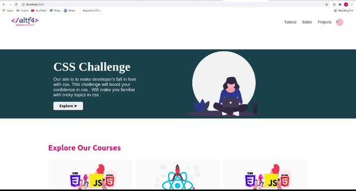
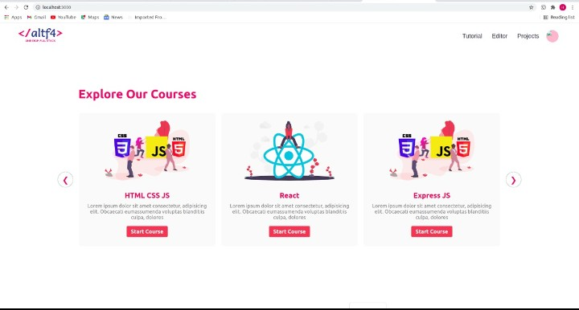
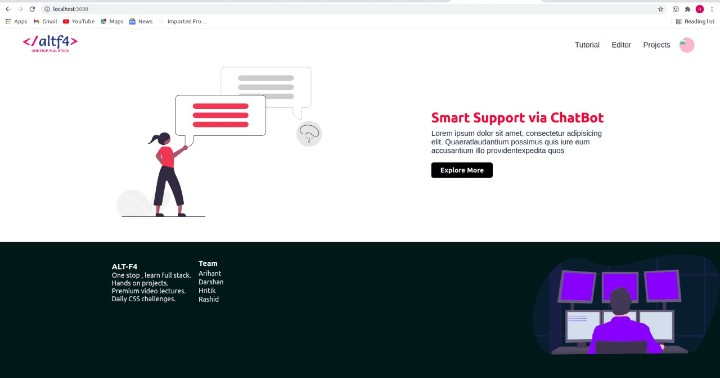
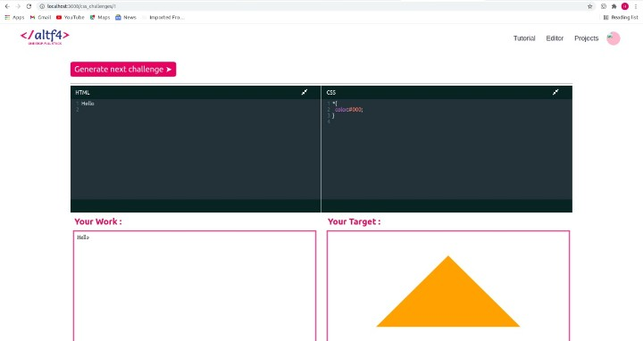
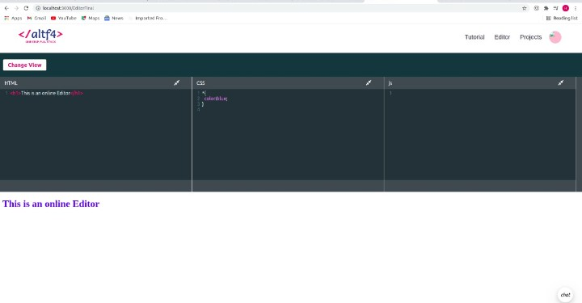
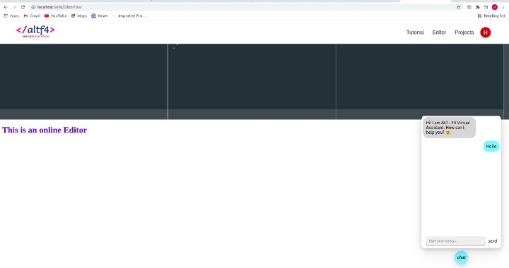

> checkout website here https://e-tutorial.herokuapp.com/

> Used React for frontend .

# video streaming educational site to learn web dev

## Overview of the project
## features 
### 1)Video section
### 2)Online Editor
### 3)CSS challenge
### 4)Project Ideas
### 5)Chatbot

 
 

 
 

 
 

 
 

 
 

 
 

